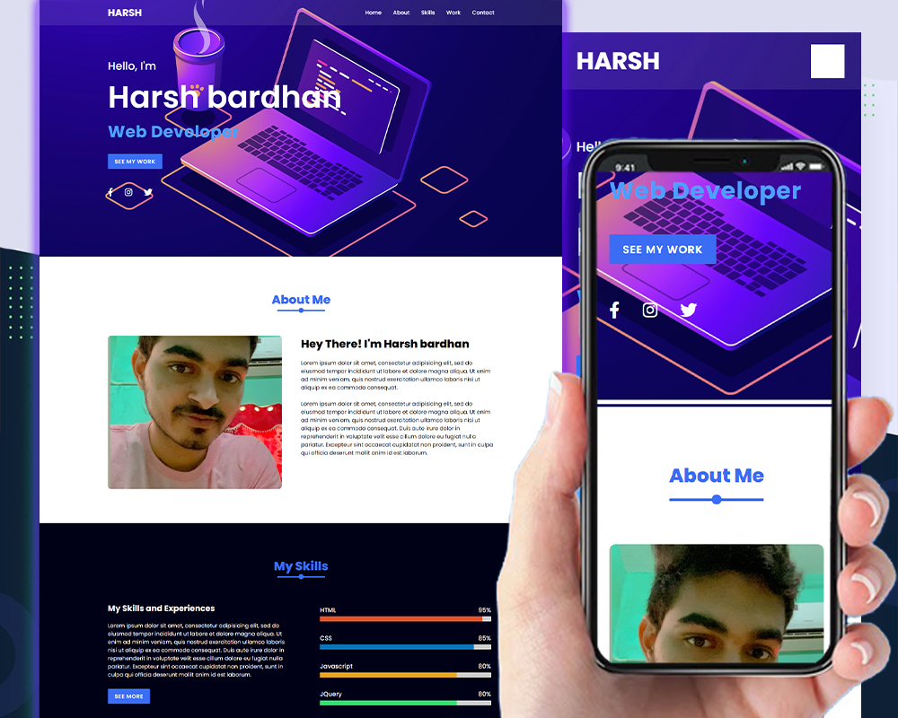

# IITISoC--Personal-Website-Project---Team-1

Please click on this link to access our project=>

https://iitisocweb8.herokuapp.com/
```bash
https://iitisocweb8.herokuapp.com/
```
Github link=>

https://github.com/harshahb/IITISoC--Personal-website-Project----Team-1.git
## Team Members

- Harsh Bardhan
- Pragya Singh
- Vishal Chichani
- Harshwardhan Chaube
### Mentor: Kuldeep Singh
## Project Overview :

We have tried to design a personal website. But it is not like a comman portfolio website.
With each refresh, you get a fresh and newly generated stylesheet which certainly attracts you to dive deep into the website and not get bored of it.
#### Code implemented:

```bash
  const num = Math.floor(Math.random()*6)
```
This code generates a random number between 0-5 which links the css file to the index.html file using javascript.
```bash 
 document.getElementById('css_sheet').setAttribute('href', `./style/${num}/${num}.css`);
```
  Then we have linked the javascript code to our file.
  ```bash 
if(num === 0){
        //javascript for 1st stylesheet
    }else if(num === 1){
        //javascript for 2nd stylesheet
    }
    else if(num === 2){
        //javascript for 3rd stylesheet
    }
    else if(num === 3){
        //javascript for 4th stylesheet
    }
    else if(num === 4){
        //javascript for 5th stylesheet
    }
    else if(num === 5){
        //javascript for 6th stylesheet
    }

  ```

  Another thing to notice is that  we have 6 different HTML corresponding to 6 different style sheets. So we have linked all the HTML files into a single HTML file together using javascript.
  ```bash 
  document.getElementById("heading").innerHTML = "Harshwardhan Chaube Personal website";

const iconlink = `<link rel="icon" href="./style/0/icon1.png" type="image/icon type">`;
    document.getElementById("css_sheet").insertAdjacentHTML("afterend", iconlink);
  ```
## Skills :
- HTML
- CSS
- Javascript
- Github and hosting via Heroku


 

  
## Screenshots

<!-- 


 -->


  
## THANK YOU!
  